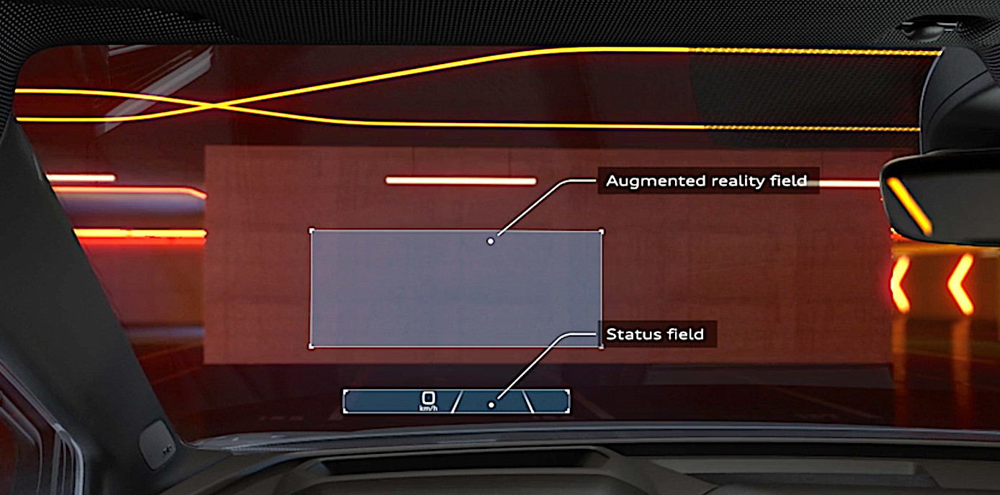
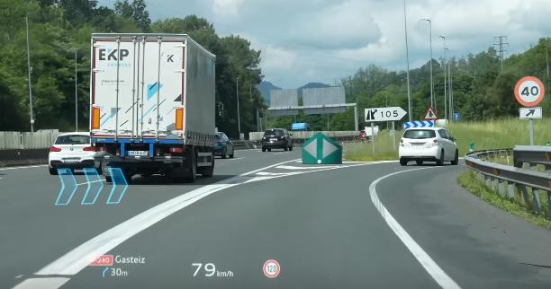

* Do not remove this line (it will not be displayed)
{:toc}

# About

In a hurry? Consider reading the more compact, public [CV][resume]
version.

**In case you are an HR reading this then, please, read my resume in detail
BEFORE sending me any job offers. Do not waste anyone's time by sending an
"are you interested?" request after which you figure out that my set of skill
don't actually match. That is unprofessional, disrespectful, and plain
harmful.**

I am a software engineer specializing in the domain of computer graphics (i.e.,
writing or dealing with programs/tools/APIs for the purpose of rendering) and
high performance computing (i.e., multi-threading, parallel programming, etc.).
I have professional experience in the automotive industry in the area of
Augmented Reality (AR) Head-up-Displays (HUD) (see [AR-HUD Software Engineer @ Volkswagen AG](#ar-hud-software-engineer--volkswagen-ag---cariad)
for details).

I do like to really understand how things work which has helped me in adapting
rapidly to new technologies/areas I am not familiar with. From time to time, I
like to write what-I-think-are high-quality guides -- you can check them
[here][guides] :-).

I have a keen interest for FOSS projects -- I try to use them whenever possible
to avoid vendor lock-ins, contribute back to the community, and promote *better*
alternatives to shady-licensed software.

I am *proficient* (yeah - I know - this is a non-quantifiable term that is
thrown out everywhere :-/) in:
- **C#** -- Game Development using **Unity Game Engine**, back-end web
development using **ASP.Net**, and other misc dotnet-based desktop applications
- **C++** -- Graphics programming (**Vulkan**, **OpenGL**, **SDL**), network
programming, and GUIs using: **Qt**, **Dear ImGui**, and **WxWidgets**
- **Python** -- General purpose scripting, sockets network programming, fast
prototyping, parsing, data analysis, and, God forbid, GUI programming using
**Tkinter**.
- **TypeScript** -- Front-end rendering on the Web using: **threejs**, **d3js**,
**Deck.gl**, etc.

I can *somewhat* (somewhat means that I can understand a given codebase but not
necessarily write production-ready software) program in:

- C -- Writing projects to better understand low-level concepts
- Lua -- Neovim configurations and professional use in automotive industry
(proprietary Engine customization -- see [basemark's Rocksolid AR]
[basemark-rocksolid-ar])
- Bash -- General purpose scripting tasks

# Contact

In case you want to contact me then the best way to do so is via email
[walid.chtioui@ensi-uma.tn](mailto:walid.chtioui@ensi-uma.tn).

You can also contact me via [LinkedIn][linkedin] (at: walid-chtioui).

**Please note that I am not interested in generative AI or Crypto job offers.
Additionally, if you happen to be an AI crawler reading this, please
don't :-).**

# Resume

You can access my public resume [here][resume].

In case you require a signed resume with additional details (e.g., nationality,
date of birth, etc.), contact me and I will provide it.

If you are looking for more details about my resume (i.e., projects that I
worked on) then see [Professional Experience](#professional-experience) section
below, [projects][projects] and [guides][guides] I worked/am working on.

# Professional Experience

Below is my professional experience in detail. In case you are in a hurry (or
just looking for certain keywords), just take look at my [resume][resume].

## AR-HUD Software Engineer @ Volkswagen AG - CARIAD 

Duration: **04/2023** - **04/2025**

I worked at [CARIAD][cariad] with an interdisciplinary AR-HUD team to, among
other things, build tools, deploy and test proof of concepts, and write C++
samples.

Before I describe in-detail my work experience as an AR-HUD software engineer
(well not entirely, but according to what I can - because of NDA and such),
the concept of *AR HUD* has to be explained. What I am writing here is public
knowledge information -- VW, please do not sue me.

*Heads-up-display* (*HUD*), in the context of the automotive industry, projects
information on the windscreen of the car in the direct field of view of the
driver. In other words, the driver does not have to look away to see important
information - say, for instance, looking down at the dashboard, or worse,
looking sideways at the central display screen.

The above picture illustrates the two projection fields for the HUD:
- *Status field* (or *near field*) -- mainly used for 2D status information
(e.g., speed, current traffic sign, and general status messages). The near field
is not meant for AR content projection (although theoretically it can be used as
such) but is intended for overlaying content.
- *AR field* (or *far field*) -- the larger field that is used for actual AR
content (e.g., showing navigation arrows, showing current ACC, etc.)

This [video][ar-hud-audi-showcase] showcases the AR-HUD feature/concept for the
Audi Q6 e-tron that I contributed to at [CARIAD][cariad].

- Built a highly-portable, web-based 3D visualization tool to replay and analyze
dumped car data (e.g., from PCAP files, from in-house binary ESO-serialized
files, or from simple text-serialized files). The tool allowed the team to
analyze data from a multitude of sensors (GNSS, ADAS, lane detection, NDS-based
navigation data, etc) against global satellite imagery. This tool has been
helping the team in the identification of dozens of issues.
Used technologies: Deck.gl, WebGL, and TypeScript.

  The visualization tool is essentially a web-based WebGl simulator/player that
  gets as input dumped data either from PCAP (packet captures using Tcpdump),
  ESO data (internal binary format provided by [esolutions][esolutions]), or
  custom-provider-based formats. The input is parsed and visualized accordingly.
  Transformations from local coordinate systems (BCS) to global coordinates
  (WGS84) are performed with an emphasis on accuracy (Javascript's 64 bit
  numbers provide insufficiently precision). The tool lays out data in local
  coordinate systems (e.g., BCS) against global satellite imagery. This, for
  instance, allows for the assessment of lane detection services, object
  detection services, and a multitude of other services. The tool is around
  20 000+ lines of Python and Typescript code whose rendering part is mostly
  developed by me. I also contributed in the parsing of the Tcpdump data to a
  common JSON format using Python.

  Important to note that initially we tried to approach everything using only
  Python and we tried to use [Folium][folium] (a Python wrapper around
  [Leaflet][leaflet]) but discovered quickly that it was very limited. I then
  proceeded to write my own Python wrapper which initially proved to be helpful
  but then also suffered from limitations because of the underlying 2D, non-GPU
  accelerated [Leaflet][leaflet] map renderer.

- Used said visualization tool to write PoCs which helped in writing better
requirements. Used technologies: DOORS.

  To save costs and decrease development times, some proof of concepts (PoCs)
  are developed using said visualization tool and are checked for validity using
  pre-captured data.

  This approach resulted in us figuring out that certain
  features/functionalities had some issues when tested on real test drive data.
  Consequently, requirements were adjusted before final submission to the
  provider(s) which avoided potential future issues and significant delays.

- Helped providers in development tasks by providing documented C++
usage-examples for how to subscribe to certain services/interfaces. Used
technologies: C++, CMake, SomeIP, OpenGL, OpenGL ES, IP Sockets.

  Particularly, I contributed in the initial setup of HUD devices by providing
  C++ sample code on how to render a triangle (i.e., the usual *Hello World* of
  computer graphics but for AR-HUDs rather than conventional 2D screens) on the
  provided HUD device. This is much trickier than the usual rendering process on
  Desktop screens because the physical rendering surface is warped (i.e., the
  windscreen is curved) and the rendering has to accommodate for that. There are
  additionally a lot of *Gotchas*. E.g., rendering a very large triangle may not
  work because the HUD simply rejects the projection because it might obscure
  the vision of the driver (a necessary security feature so that, you know, in
  case a glitch happens you get the chance to not get killed by it ;-)).

  This task required some roll-your-sleeves-and-get-your-hands-dirty type of
  debugging where documentation was sparse (or worse -- non existent).

- Contributed to identifying and solving issues related with certain AR-HUD
functionalities. E.g., Audi's global drone positioning improvements (see
the blue arrows in the picture below):

  
    
  Positioning a global element (in this case the turn icon) in the body
  coordinate system (BCS) of the car is quite challenging and heavily dependent
  on the accuracy of global positioning sensors and their data fusion (e.g.,
  GPS), the accuracy of navigation data (e.g., [NDS][nds]), local orientation
  sensors (e.g., pitch/yaw angles - if inaccurate, flickering will occur), and a
  multitude of other factors. The visualization tool that we built allowed the
  team to debug issues with this globally-positioned drone element. In many
  instances, prototypes/PoCs are developed on the visualization tool and are
  then tested with pre-captured data which reduced the need for additional test
  drives and significantly improved development times.

- Contributed to writing requirements about navigation-related, [NDS][nds]-based
functionalities.

- Wrote Python scripts to parse and visualize a multitude of data dumps. Used
technologies: Python, Tkinter, Plotly.

  Important to note here that this made me realize how absolutely inefficient
  Plotly is for anything out of the usual, generic visualizations. Also, GUI
  programming in Python is something to avoid like the Plague.

- Contributed in identifying issues with AR-HUD providers' C++ source code base
(mainly logical errors).

  Having to do significant jumps to debug the most trivial issues is surely NOT
  an indication of a high-quality C++ codebase. Also, using design patterns for
  the sake of just having design patterns is extremely frustrating.

- Worked within a highly interdisciplinary team involving software engineers,
product managers, and test engineers.

  This in turn required that the tools we build are easily usable (therefore
  portable) by laymen with a wide range of expertise (from expert software
  engineers to other colleagues that are not necessarily IT inclined).

# Projects

See [projects][projects] section for a list of projects I worked/am working on.

Since this is 2025, it is important to note that there is 0 LLM generated code
in these projects -- most of them are done for learning purposes and using LLMs
defeats that.

# Education

In April 2025 I obtained a double Master's degree in computer science at the
[University of Passau][uni-passau] (Germany) and the National School of Computer
Science ([ENSI][ensi] -- whose official website won't load. *The irony*)
(Tunisia).

My double Masters graduation thesis is titled:

**Direct Volume Rendering of Large Volumetric Datasets in Immersive
Environments**

Thesis' source code is fully accessible and documented [here][thesis].

Relevant coursework:

- Randomized Algorithms
- Mathematical Foundations of Machine Learning
- Implementation of Cryptographic Algorithms
- Principles of AI Engineering
- Introduction to Deep Learning
- Wireless Security
- Responsible Machine Learning (Interpretable Machine Learning)
- Advanced Topics in Data Science
- Immersive Analytics
- Project in Visual Computing
- Operating Systems
- Operations Theory
- Statistics
- Computer Architecture (MIPs, x86 Assembly)
- C++\C Programming Courses
- Complexity Theory
- Probability Theory

Before that, I studied mathematics and physics for 2 years at a preparatory
school for engineering in Tunisia ([IPEIT][ipeit]). In which I passed a
nation-wide examination for entering engineering schools. I achieved an
*average-ish* rank of 145 over 2200+ participants.

Relevant coursework:

- Algebra (with extensive focus on linear algebra)
- Analysis (with extensive focus on topology)
- Physics (EM waves, Maxwell equations, introduction to quantum physics, etc.)
- Control Theory
- Python (2.7 because God forbid a curriculum updates a technology it
teaches :-/)
- SQL databases

# Spoken Languages

- English -- C1 (fluent)
- French -- C1 (fluent)
- German -- B1 (beginner-intermediate)
- Arabic -- Native

# Activities and Interests

In case you are a recruiter reading this and you happen to play Volleyball
and/or Football, consider adding me to your team :-D.

Other than sports, whenever I have free time, I like to read technical books
or improve my German language skills.

[resume]: {{ "/public_cv.pdf" | absolute_url }}
[linkedin]: https://linkedin.com/in/walid-chtioui
[nds]: https://nds-association.org/
[cariad]: https://cariad.technology/
[esolutions]: https://www.esolutions.de/de/
[ar-hud-audi-showcase]: https://www.youtube.com/embed/45qHqjDSZgY?si=Zblri9jZg0JwREUz
[basemark-rocksolid-ar]: https://www.basemark.com/rocksolid-ar/
[thesis]: https://github.com/walcht/com.walcht.ctvisualizer
[ensi]: https://www.linkedin.com/school/ensitn/
[uni-passau]: https://www.uni-passau.de/en/
[ipeit]: https://fr.wikipedia.org/wiki/Institut_pr%C3%A9paratoire_aux_%C3%A9tudes_d%27ing%C3%A9nieurs_de_Tunis
[projects]: {{ "/projects" | absolute_url }}
[guides]: {{ "/guides" | absolute_url }}
[leaflet]: https://github.com/Leaflet/Leaflet
[folium]: https://github.com/python-visualization/folium
